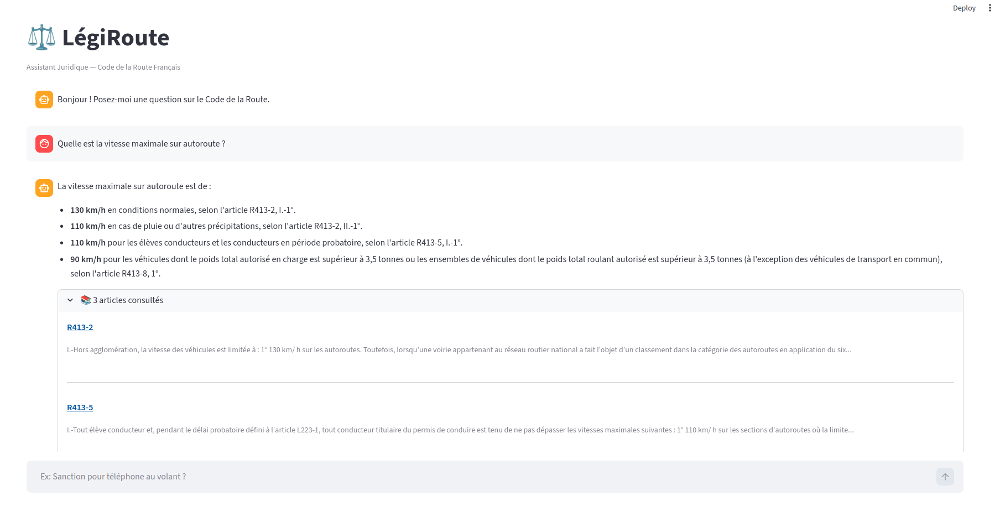

# LégiRoute

[](https://www.python.org/)
[](https://python-poetry.org/)
[](https://streamlit.io/)
[](https://www.pinecone.io/)
[](https://ai.google.dev/gemini-api/docs/models/gemini#text-embedding)
[](https://deepmind.google/technologies/gemini/)
[](LICENSE)

RAG system that answers questions about the French Highway Code (*Code de la Route*) with cited legal articles from Légifrance.

Ask a question in natural language, get back a grounded answer with the exact articles and links to the official source.

## Setup

```bash
# Install dependencies
poetry install

# Set your API keys
cp .env.example .env
# Fill in GOOGLE_API_KEY and PINECONE_API_KEY

# Parse XML articles (if you have the raw LEGI dump)
poetry run python src/ingestion/parser.py

# Build the vector index
poetry run python src/ingestion/indexing.py

# Run Streamlit app
poetry run streamlit run src/app.py

# Run CLI
poetry run python main.py

# Run evaluation
poetry run python eval/eval_ragas.py
```

## Usage



The Streamlit app provides a chat interface with streaming responses. Each answer cites the relevant articles, displayed in an expandable panel with direct links to Légifrance.

## Architecture

```
                        +-----------------+
          user query -->| IntentClassifier|---> OFF_TOPIC: polite refusal
                        | (Gemini Flash)  |---> CHITCHAT: direct response
                        +-------+---------+
                                |
                           LEGAL_QUERY
                                |
                                v
                        +-----------------+
                        | TrafficRetriever|  Pinecone (cosine similarity)
                        | (embed + search)|  3072-dim Gemini embeddings
                        +-------+---------+
                                |
                          top-k articles
                          filtered by relevance threshold
                                |
                                v
                        +-----------------+
                        | TrafficGenerator|  Gemini Flash (streaming)
                        | (prompt + cite) |  grounded on retrieved articles
                        +-----------------+
                                |
                                v
                        cited answer + Légifrance URLs
```

Pipeline modules are decoupled via an `LLMProvider` interface: the classifier, retriever, and generator each receive a provider instance at construction time. Swapping to another LLM backend means implementing three methods: `embed`, `generate_stream`, `classify_intent`.

## Data Source

Articles are parsed from the [DILA LEGI XML dataset](https://www.data.gouv.fr/fr/datasets/legi-codes-lois-et-reglements-consolides/) (open data), not a web scraper or PDF extractor. The XML format provides structured metadata (hierarchy, status, dates) that would be lost with scraping.

**1161 articles** indexed, covering speed limits, alcohol, equipment, penalties, signage, EDPM, etc.

Only articles with `ETAT=VIGUEUR` (currently in force) are retained. A legal assistant returning a repealed law is a critical failure, so no soft filtering: binary keep/discard.

The Code de la Route frequently cites external codes (Code pénal, Code des assurances). For now, we ingest only the text representation of these citations. This lets the LLM see and quote the reference without requiring us to cross-index all 73 French legal codes.

## Evaluation (RAGAS)

Evaluated on a **61-question dataset** across 18 categories, scored by an LLM judge (Gemini).

| Metric | Score |
|--------|-------|
| **Faithfulness** | **0.935** |
| **Context Precision** | **0.940** |

- **Faithfulness**: does the answer only use information from the retrieved context? (no hallucination)
- **Context Precision**: are the retrieved articles actually relevant to the question?

These two metrics isolate whether the problem is retrieval or generation:
- High Context Precision + low Faithfulness = retriever works but the LLM hallucinates -> fix the prompt
- Low Context Precision + high Faithfulness = wrong articles but faithful to them -> fix the retriever

Evaluation script: `eval/eval_ragas.py`. RAG results are cached to disk (`rag_cache.json`) so that if RAGAS scoring crashes (rate limits, dependency issues), the 61 API calls aren't wasted. `--no-cache` forces a fresh run.

## Architecture Decisions

### Intent classification before retrieval

The first implementation used a keyword + length heuristic (`len < 30` + keyword list). The false positive rate was too high: "Peut-on klaxonner ?" (legal question, 19 chars) was misclassified as chitchat.

The current approach uses a lightweight LLM classifier (Gemini Flash Lite, ~50 tokens) that routes each query before hitting the vector DB. This avoids wasting embedding calls on greetings or off-topic questions, and lets the system respond naturally to chitchat without fabricating legal citations.

Three intents:
- `LEGAL_QUERY` -> full RAG pipeline (embed -> search -> generate)
- `CHITCHAT` -> direct LLM response (no retrieval)
- `OFF_TOPIC` -> polite refusal

**Safety default**: any classification failure defaults to `LEGAL_QUERY`. Better to run unnecessary retrieval than to block a real question.

**Trade-off**: adds one LLM call per query (~100ms). Worth it because looking up and citing legal articles for a "Bonjour" makes no sense and would degrade answer quality.

### Structured output for classification

The classifier uses Gemini's `response_schema` with `response_mime_type="application/json"` to force a valid JSON enum (`LEGAL_QUERY | CHITCHAT | OFF_TOPIC`). No regex parsing, no retry loops. A dedicated test verifies the Python `Intent` enum and the JSON schema enum stay in sync.

### Embedding strategy

**Asymmetric embeddings**: Gemini's embedding API supports task types natively, `RETRIEVAL_DOCUMENT` for articles, `RETRIEVAL_QUERY` for questions. This optimizes the vector space differently for each role, improving recall when short questions ("vitesse autoroute ?") need to match long legal articles.

**Full context hierarchy in the embedding blob**: each article is embedded as `"{context_path}\nArticle {number} : {content}"` rather than just the raw content. This lets the embedding model capture the structural position of an article (e.g., "Livre IV > Titre I > Vitesses" disambiguates articles that mention "50 km/h" in different legal contexts). The blob is a computed field (`blob_for_embedding`), precomputed once at ingestion, not at query time.

**Content/blob separation**: the retriever stores raw content separately in Pinecone metadata. The embedding blob (context + article + content concatenated) is the indexing input, but `meta.get('content')` is what gets displayed and sent to the generator. This clean separation means the LLM receives well-structured sources (path, content, URL as separate fields) instead of a monolithic blob.

### Chunking: one article = one chunk

Most articles in the Code de la Route are short: median length is 103 words, and 95% of articles are under 500 words. Splitting them further would break the legal atomicity of each article and make citation harder (the LLM needs to cite "R413-17", not "R413-17 chunk 2 of 4").

The current approach embeds each article as a single chunk. Only 9 articles out of 1161 exceed 1000 words, so the trade-off is acceptable.

If the system is extended to cover other legal codes (e.g., Code pénal, which the Code de la Route frequently cites), a different chunking strategy will be needed since those codes contain much longer articles.

### Pinecone with cosine similarity + relevance threshold

Pinecone was chosen after the initial ChromaDB prototype to enable serverless deployment: ChromaDB requires writing to a local filesystem, which is incompatible with ephemeral cloud containers. Pinecone provides a managed vector index accessible over HTTP, with no local state.

Cosine similarity scores range from 0 to 1 (higher = better). A hard relevance threshold (`score > 0.5`) filters out results that are "best available but still bad". This prevents the generator from hallucinating when the knowledge base genuinely doesn't cover a topic.

**Batch processing**: batches of 5 with sleep between batches, tuned for Gemini's free tier rate limits. Exponential backoff (tenacity) handles transient 429s. 400 errors (invalid request, e.g., token overflow) are not retried since they'd fail forever.

### Provider abstraction

All LLM calls go through an `LLMProvider` ABC (`embed`, `generate_stream`, `classify_intent`). Modules never import `google.genai` directly. This makes testing straightforward (mock the interface, not the SDK) and keeps the door open for multi-provider support without touching pipeline code. Adding a new provider means subclassing `LLMProvider`, the rest of the pipeline is untouched.

Other LLM providers will be added in the future to benchmark them against Gemini on the same evaluation dataset.

### Generation

The system prompt enforces strict rules: never self-introduce (was adding "Je suis LégiRoute..." to every response), mandatory article citations, no fabrication beyond provided sources, concise structured responses. Each source is presented as a structured block with article number, hierarchy path, content, and Légifrance URL, giving the LLM explicit citation targets.

Max tokens increased from 1000 to 2048 after observing truncated responses mid-sentence on complex multi-article questions.

### Schema design

| Field | Role |
|-------|------|
| `id` | Primary key, direct traceability to source XML. Enables debugging when RAG returns incorrect text |
| `article_number` | Citation key: the LLM must cite "R413-17", not internal IDs |
| `content` | Raw text, separated from the embedding blob for clean display |
| `context` | Hierarchy path: `Code de la route > Partie réglementaire > Livre IV > ...` |
| `blob_for_embedding` | Computed field, pre-concatenation of context + number + content |
| `full_url` | Computed field, Légifrance URL reconstructed from ID |

## Tests

```bash
poetry run pytest tests/ -v
```

73 tests covering classification routing, structured output parsing, fallback behavior, context formatting, model validation, XML parsing, and retrieval logic. All tests run without API calls, mocking or pure computation only.

## Roadmap

- **Automatic database updates**: the DILA dataset is updated regularly. The pipeline will periodically re-download, diff against indexed articles, and re-embed only the changed ones.

---

**Author**: Sami Contesenne - [sami.contesenne496@gmail.com](mailto:sami.contesenne496@gmail.com)
